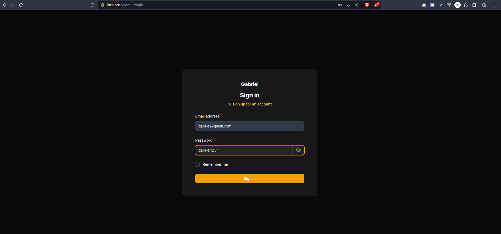

<h2 align="center">Laravel com Filament</h2>

___


<p align="center"></p>

___

O filament 3.2 ja tem a função de visualizar a senha. 

</p>

## About Laravel

Aqui eu iniciei um projeto laravel do zero. instalei o tall stack e em 
seguida o filament. Vou deixar aqui todos os comandos na ordem em que rodei.


___
<p>Criar o projeto laravel com mysql</p>

```bash
curl -s "https://laravel.build/curso-filament?with=mysql" | bash
```
<p>Instala o tall stack</p>

```bash
sail composer require livewire/livewire laravel-frontend-presets/tall
```

<p>Instala as dependências do pacote acima</p>

```bash
 sail art ui tall
```

<p>Instala e roda o npm</p>

```bash
 sail npm install && npm run dev
```

<p>Sobe o banco</p>

```bash
 art migrate
```

<p>Instala o Filamnet</p>

```bash
 sail composer require filament/filament:"^3.2" -W
```

<p>Instala as dependências Filamnet</p>

```bash
 art filament:install --panels
```

___


### links usados

- **[Laravel-install](https://laravel.com/docs/10.x#sail-on-linux/)**
- **[Filament-install](https://filamentphp.com/docs/3.x/panels/installation)**


